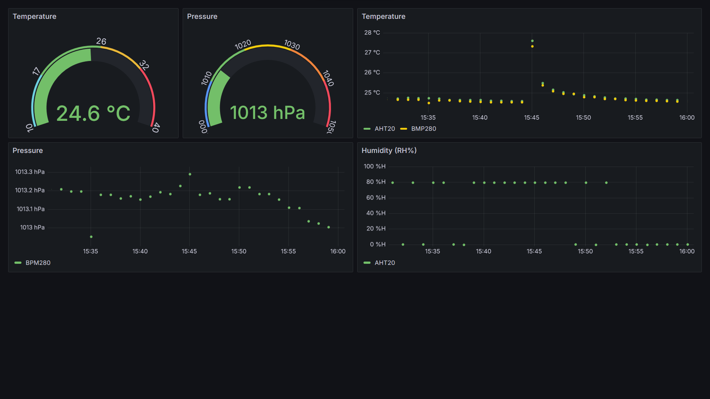

# AHT20_BMP280_python
Simple python functions and scripts to read data value from AHT20 and BMP280 sensors 

I couldn't find a simple way to read AHT20 and BMP280 sensors values using my rapsberry pi so I implemented two reading function in python.
I added a script to record the data in an Influx database with cron and then diplay it with grafana (record_sensors.py). 
The grafana dashboard is also available in dashboard_config.json.

